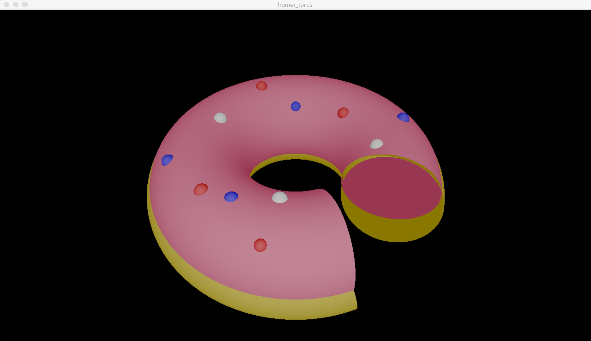

RT

This project’s goal is to trasform the basic raytracer of the project (rtv1) to a raytracer able to generate
amazing images (RT). This is accomplished implementing  a multitude of new functions to the raytracer.
This project has been realized by a group of 4 students.

Here is a scene file example: [basic_02.sc](scene_examples/basic_02.sc)

__NOTE:__
The whole project was realized using the school's graphic library: MinilibX.
This library contains only basic drawing functions: open a window, lit a pixel and manage events.
Everything else must be coded by studentsm ex: 
(XML and OBJ files parser from scratch, Camera quaternion model, Object intersections,
Vector and Matrix calculations creating our own respectively libraries, Shading models: lambert, phong, Snell-Descartes laws...
Texture mapping, Screenshots from a char string containing rgb values to ppm format, Light color mixing, Polygons to Triangles convertions, ...)

__Realized options:__
- Advanced XML format scenes
- Adjustable ambient light
- Adjustable resolution / FOV 
- Directions, rotations and translations for every object
- Dazzling light (ex. car headlights)
- Parallel light (directional enlightenment)
- Rectangle light (soft shadows)
- Reflexion (Possibility to decide the percentage)
- Transparence (Possibility to decide the percentage and refraction index)
- Shadows that change according to object's transparency
- Other objects: paraboloids, hyperboloids, ellipsoid, cube
- Disk object cutting a plane according to a radius
- Third degree surface: Mobius strip (Cartesian equation)
- Fourth degree surface: Torus (Cartesian equation)
- Objects group (we can define an object composed of several objects)
- Negatives objects
- Loading bar
- Camera rotations (x, y, z) / dazzling light activation / fov changements without relaunch the program
- Perturbation: Normal (alternations with sinus algorithm)
- Perturbation: Color (checkerboard, perlin noise)
- Texture can be applied: sphere, cone, cylinder and plane
- Texture can be stretched and displaced
- Texture: normal alterations, bump mapping
- Effect: Antiliasing
- Effect: Celshading
- Effect: Motion blur
- Effect: Anaglyph 3D
- Effect: Color filters (speia, inverted, grayscale)
- Multithread
- Screenshots (PPM format)
- Muticluster computation
- OBJ file reader (and converter to XML format)

_If you are interested to the complete code, please do not hesitate to contact me._
